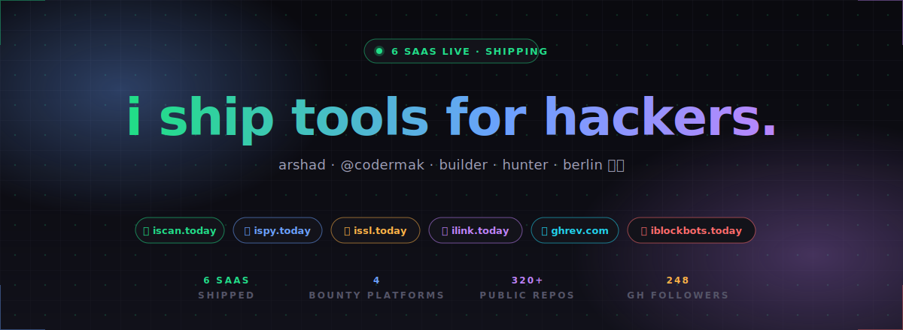

<!-- Hero: custom SVG (assets/hero.svg) — dark, gradient headline, tool-chip row, stat strip -->

<!-- Rotating subtitle below the hero -->

<!-- Stat chips for instant social proof -->

  
  
  

<!-- Socials -->

 

## 🚀 Tools I'm Shipping

<table align="center">
<tr>
<td width="50%" align="center">

### [🔍 iScan.today](https://iscan.today)
**Secret scanner for bug bounty hunters.**  
Catch leaked secrets — earn bigger bounties.

</td>
<td width="50%" align="center">

### [👀 iSpy.today](https://ispy.today)
**Real-time GitHub leak monitor.**  
Get alerts the moment secrets drop.

</td>
</tr>
<tr>
<td width="50%" align="center">

### [🔒 iSsl.today](https://issl.today)
**SSL & subdomain takeover alerts.**  
Slack + Discord, on autopilot.

</td>
<td width="50%" align="center">

### [🔗 iLink.today](https://ilink.today)
**E2E encrypted self-destruct links.**  
The encrypted Privnote alternative.

</td>
</tr>
<tr>
<td width="50%" align="center">

### [🤖 GhRev.com](https://ghrev.com)
**AI copilot for GitHub PR reviews.**  
Workflow diagrams, PR-aware chat.

</td>
<td width="50%" align="center">

### [🚫 iBlockBots.today](https://iblockbots.today)
**Kill AI reply bots on X.**  
Chrome extension. BYO API key.

</td>
</tr>
</table>

 

## 🐛 Hunting as `codermak`

 

## ⭐ Open Source

+ 320 more repos on [@arshadkazmi42](https://github.com/arshadkazmi42?tab=repositories)

 

### 💬 Got an idea or want to collab? [DM me on X →](https://twitter.com/arshadkazmi42)

